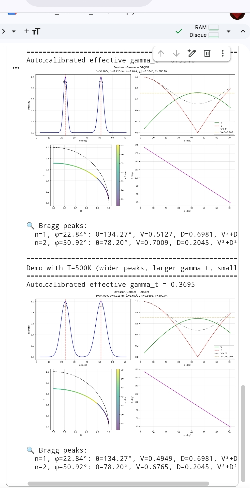

# DTQEM – Unified Framework for Open Quantum Systems

**Davisson–Germer | Quantum Tunneling | Schottky Effect | Balance Condition V = D**

## ⚠️ License Change Notice (v13.0)

Starting from version 13.0, DTQEM is released under the **DTQEM Research & Educational License** (see [`LICENSE`](LICENSE)).  

**Commercial use is not permitted** without explicit written permission.  
Academic, educational, and non‑commercial research use is free and encouraged.

For commercial licensing inquiries, contact: reddoma@gmail.com

---

This repository provides a full numerical framework for simulating **open quantum systems** under the **Time‑Sovereignty** hypothesis (DTQEM). It includes three validated physical applications and an exact analytical balance condition `V = D` for pure dephasing.

---

## 🔬 Core Applications

### 1. Davisson–Germer Experiment (Electron Diffraction)
- Computes Bragg angles, visibility `V`, distinguishability `D`, and complementarity `V²+D²`.
- Auto‑calibrates the decoherence rate `γ_t` from the diffraction peak width.
- Includes temperature‑dependent peak broadening and `γ_t`.
- **Location:** `examples/davisson_germer/`

### 2. Quantum Tunneling in a Double Well
- Particle in a symmetric double well (`H = (Δ/2)σₓ`) with Lindblad dissipation:
  - Pure dephasing: `L_φ = √γφ₀ σ_z`
  - Thermal relaxation: `L_± = √γ_rel σ_∓` (temperature dependent)
- Computes tunneling probability `P_right(t)`, `V(t)`, `D(t)` and first tunneling time.
- Demonstrates the transition from coherent tunneling to incoherent hopping.
- **Location:** `examples/tunneling/`

### 3. Schottky Effect (Field‑Enhanced Thermionic Emission)
- Two‑level system (metal |M⟩, vacuum |V⟩) with escape rate `γ_emit` from the Richardson‑Dushman formula modified by barrier lowering `Δφ = √(e³E/(4πε₀))`.
- Interactive GUI to study current vs. temperature and electric field.
- **Location:** `examples/schottky/`

---

## ⚖️ Analytical Balance Condition `V = D` (Pure Dephasing)

From the Lindblad master equation with only `σ_z⊗I` dephasing, we derived an exact condition for wave‑particle equality:

\[
\boxed{\gamma_{\phi0}\;t_{\text{obs}} = 2\ln(\tan\theta)},\qquad \theta > 45^\circ
\]

where:
- `γφ₀` – pure dephasing rate (as used in the code; physical rate = γφ₀/2)
- `t_obs` – observation/evolution time
- `θ` – initial angle of the entangled state `|ψ(θ)⟩ = cos(θ/2)|00⟩ + sin(θ/2)|11⟩`

**This equation:**
- Corrects the earlier misconception of a fixed “magic angle” (≈65°) – the balance angle varies with `γφ₀·t_obs` via `ln(tan θ)`.
- Provides a design tool for experiments aiming at `V = D`.
- Enables extraction of `γφ₀` from a single measurement of `θ`.

A standalone interactive script to explore this condition is available in `experiments/balance_condition.py`.

---

## 🧪 Experimental / Hypothetical Add‑ons

The folder `experiments/` contains exploratory codes that go beyond the validated models. These are **not yet experimentally confirmed** and are shared to stimulate discussion.

- `balance_condition.py` – interactive verification of the analytic `V = D` condition.
- `negative_tunnel_time.py` – a toy model exploring how a mismatch between the “clocks” of particle and barrier could produce an apparent negative tunneling time.
- `observer_frequency/` (planned) – models coupling the particle to a camera/observer with its own frequency spectrum.

All experimental files contain a clear **disclaimer** at the top. We welcome comments, critiques, and experimental collaborations.

---

## 📁 Repository Structure
